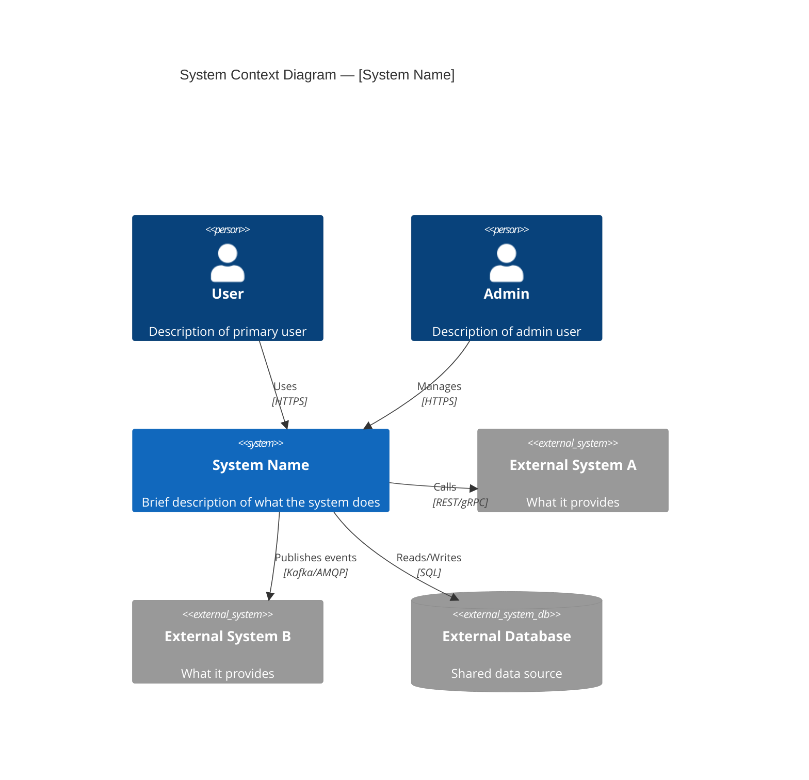
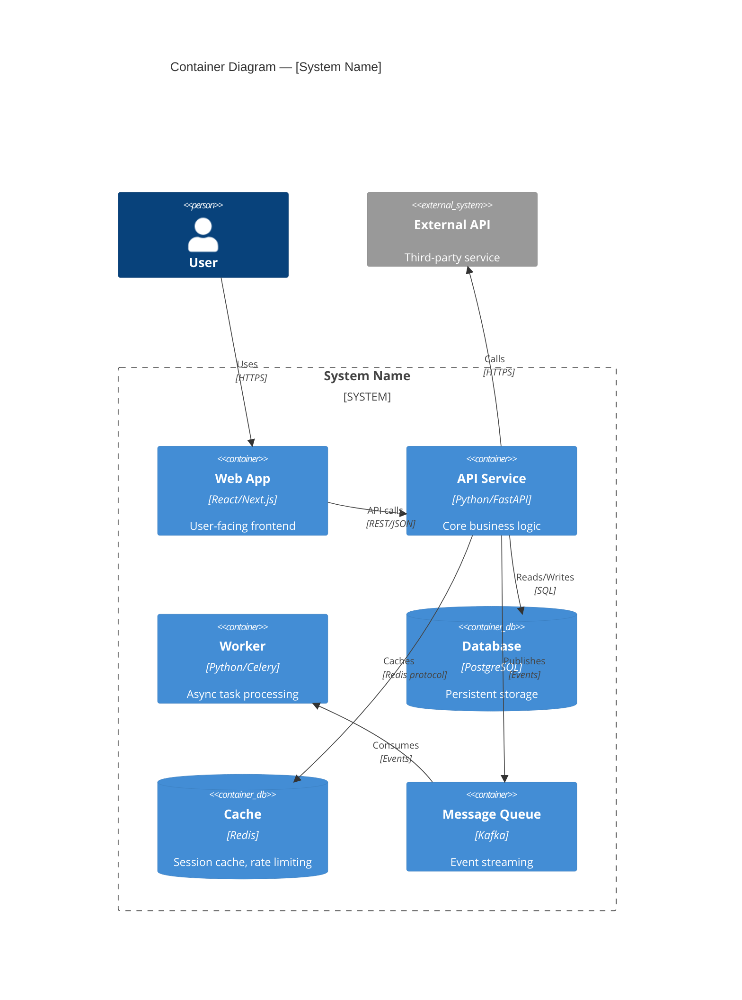
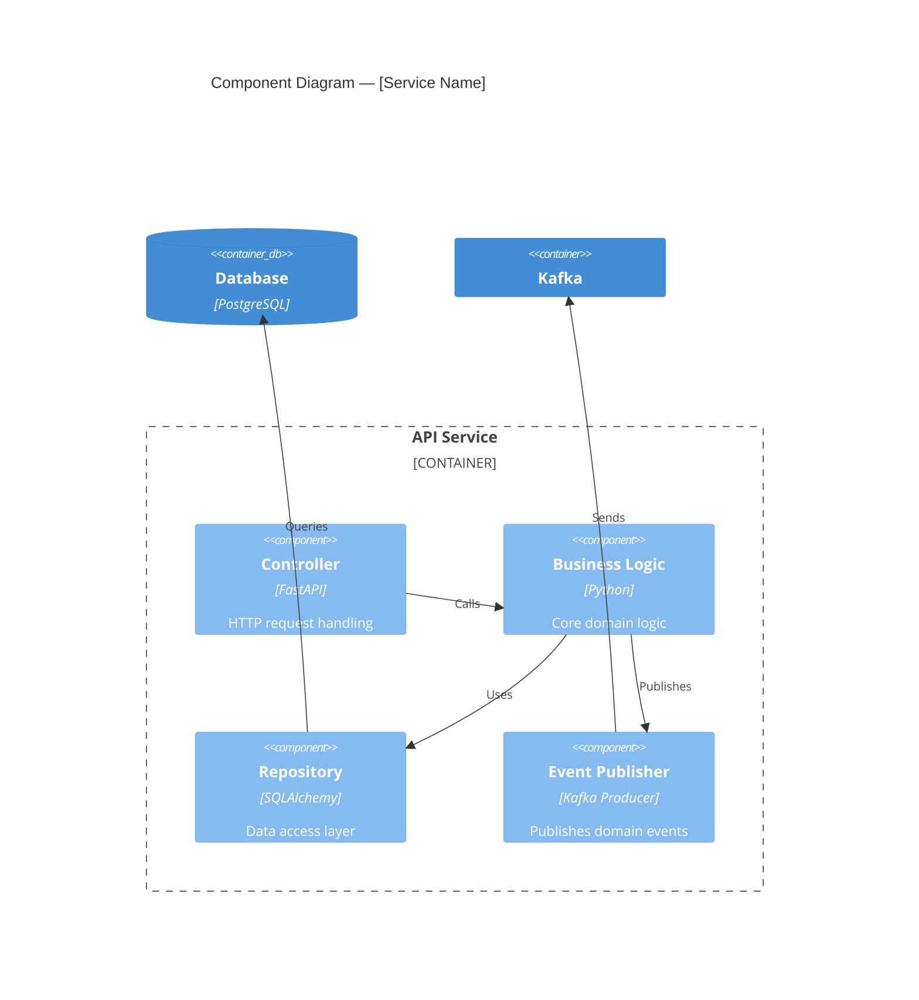
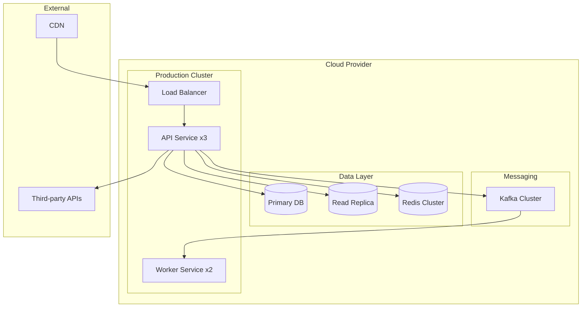
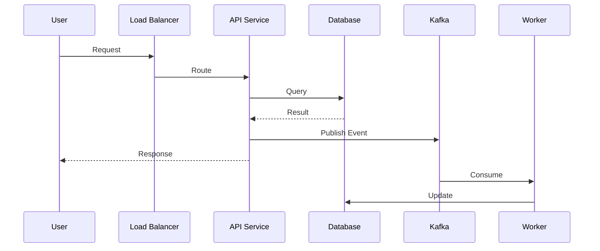
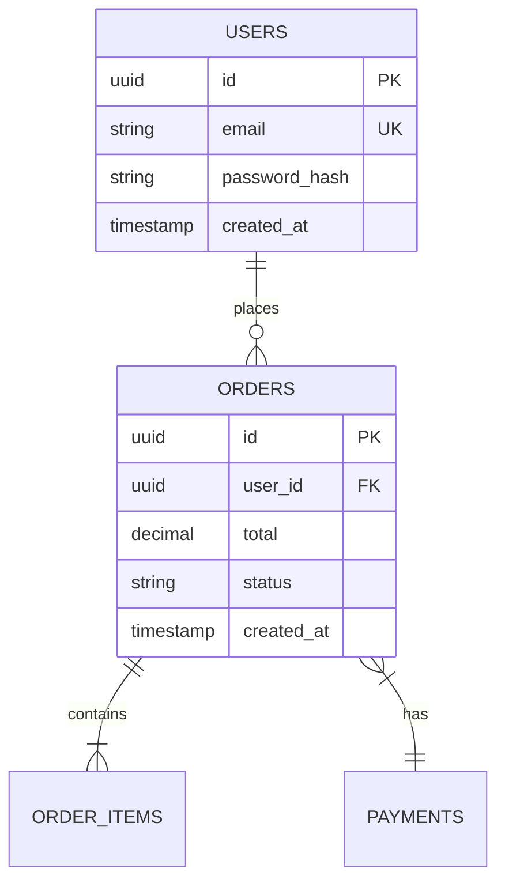
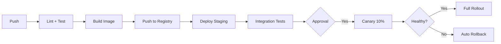

# System Architecture Document Reference Template

This template combines the arc42 documentation structure with C4 model diagrams, enhanced with
Diataxis content organization and modern docs-as-code practices. Fill in project-specific
content based on the codebase and user's description — never leave placeholder brackets in
the final output.

## Table of Contents

- [Template](#template)
- [Detail Level Guide](#detail-level-guide)
- [Writing Guidance](#writing-guidance)

---

## Detail Level Guide

Not every project needs all sections. Scale to the project's maturity:

| Level | Sections to Include | When |
|---|---|---|
| **MVP / Prototype** | 1 (Executive Summary), 4 (System Context), 12 (ADR links) | Early-stage, small team |
| **Production Service** | Above + 2 (Goals), 3 (Constraints), 5 (Solution Strategy), 6 (Building Blocks), 7 (Runtime), 9 (Cross-Cutting) | Active production system |
| **Complex System** | All sections | Large system, multiple teams, compliance requirements |

When generating, choose the appropriate level based on context and mark omitted sections with
a brief note: `[Omitted — not applicable at current project maturity]`

---

## Template

```markdown
# [System Name] — Architecture Document

**Version:** [1.0]
**Date:** [YYYY-MM-DD]
**Authors:** [Names]
**Status:** DRAFT | IN REVIEW | APPROVED
**Last Updated:** [YYYY-MM-DD]
**Detail Level:** MVP | Production | Comprehensive

---

## 1. Executive Summary

[100-200 words. Answer these questions for a stakeholder who won't read further:]
- What system is this?
- What business problem does it solve?
- What are the 2-3 most important architectural decisions?
- Who should read this document and why?

---

## 2. Introduction and Goals

### 2.1 Requirements Overview

**Functional Requirements:**
- [Key capability 1]
- [Key capability 2]

**Quality Attributes (prioritized):**

| Priority | Attribute | Target | Rationale |
|---|---|---|---|
| 1 | [e.g., Availability] | [e.g., 99.95%] | [Why this is #1] |
| 2 | [e.g., Performance] | [e.g., p99 < 200ms] | [Why this matters] |
| 3 | [e.g., Security] | [e.g., SOC 2 compliant] | [Business requirement] |

### 2.2 Stakeholders

| Stakeholder | Primary Concern | How They Use This Doc |
|---|---|---|
| [Engineers] | [How to build and extend] | [Building blocks, runtime view] |
| [Operations] | [How to deploy and monitor] | [Deployment, observability] |
| [Security] | [Threat model, data protection] | [Cross-cutting concerns] |
| [New joiners] | [System understanding] | [Executive summary, context] |
| [Product] | [Feature velocity, extensibility] | [Solution strategy, roadmap] |

---

## 3. Architecture Constraints

### Technical Constraints

- **Technology stack:** [Required languages, frameworks, databases]
- **Platform:** [Cloud provider, Kubernetes, serverless, on-prem]
- **Integration:** [Must integrate with X, Y, Z]
- **Compliance:** [GDPR, HIPAA, PCI-DSS, SOC 2]

### Organizational Constraints

- **Team:** [Size, skills, experience]
- **Timeline:** [Key deadlines]
- **Budget:** [Infrastructure budget constraints]

### Legacy Constraints

- **Existing systems:** [What we must coexist with]
- **Backward compatibility:** [What cannot break]
- **Migration path:** [Phased vs. big-bang]

---

## 4. System Scope and Context

### 4.1 Business Context

[2-3 sentences: What business domain? What problem does this system solve? How does it fit
in the organization?]

### 4.2 System Context Diagram (C4 Level 1)

This diagram shows the system as a black box surrounded by its users and external dependencies.



### 4.3 User Roles

| Role | Description | Key Workflows |
|---|---|---|
| [Role A] | [Who they are] | [What they do] |
| [Role B] | [Who they are] | [What they do] |

---

## 5. Solution Strategy

### 5.1 Approach

[2-3 paragraphs: What is the primary architectural pattern (monolith, microservices, serverless,
modular monolith)? Why this over alternatives? What are the main building blocks?]

### 5.2 Container Diagram (C4 Level 2)

This diagram zooms into the system boundary showing the major containers (applications,
services, databases) and their interactions.



### 5.3 Design Principles

| Principle | Implication |
|---|---|
| [e.g., Fail Fast] | [How this shapes the design — e.g., "All external calls have explicit timeouts"] |
| [e.g., Observability First] | [e.g., "Every service exposes metrics and structured logs from day 1"] |
| [e.g., Loose Coupling] | [e.g., "Services communicate via events, not direct calls where possible"] |

### 5.4 Architecture Patterns

| Pattern | Where Used | Why |
|---|---|---|
| [e.g., API Gateway] | [Entry point] | [Cross-cutting concerns: auth, rate limiting, routing] |
| [e.g., CQRS] | [Reporting] | [Separate read/write models for performance] |
| [e.g., Circuit Breaker] | [External API calls] | [Prevent cascading failures] |
| [e.g., Event Sourcing] | [Audit trail] | [Complete history of state changes] |

---

## 6. Building Block View (C4 Level 3)

### Component Overview

For each major container, show its internal components:



### Service Catalog

| Service | Purpose | Tech Stack | Owner | Dependencies |
|---|---|---|---|---|
| [Service A] | [Single responsibility] | [Stack] | [Team] | [What it depends on] |
| [Service B] | [Single responsibility] | [Stack] | [Team] | [What it depends on] |

### Service Interactions

- **Synchronous:** [Which services call each other directly — REST, gRPC]
- **Asynchronous:** [Which services communicate via events — Kafka, SQS]
- **Data consistency:** [Eventual consistency, ACID, saga pattern — where each applies]

---

## 7. Runtime View

### 7.1 Deployment Topology



### 7.2 Scaling Strategy

| Component | Scaling | Trigger | Min/Max |
|---|---|---|---|
| [API Service] | [Horizontal — HPA] | [CPU > 70%] | [2-10 replicas] |
| [Worker] | [Horizontal — KEDA] | [Queue depth > 100] | [1-5 replicas] |
| [Database] | [Vertical + read replicas] | [Connections > 80%] | [1 primary + 2 replicas] |

### 7.3 Critical Data Flows

Describe the most important runtime sequences:

#### Flow: [Primary User Journey]



---

## 8. Data Architecture

### 8.1 Data Model

[Entity descriptions and relationships. Use ER diagrams or schema descriptions.]



### 8.2 Storage Choices

| Store | What | Why | Scaling | Backup |
|---|---|---|---|---|
| [PostgreSQL] | [Transactional data] | [ACID, relational queries] | [Read replicas] | [WAL to S3, PITR] |
| [Redis] | [Cache, sessions] | [Sub-ms latency, TTL] | [Cluster mode] | [Not backed up — ephemeral] |
| [Elasticsearch] | [Logs, search] | [Full-text, time-series] | [Shards + replicas] | [Snapshots] |

### 8.3 Data Consistency

- **Strong consistency (ACID):** [Where — e.g., payments, inventory]
- **Eventual consistency:** [Where — e.g., notifications, analytics]
- **Conflict resolution:** [Strategy — last-write-wins, application logic, manual]

### 8.4 Backup and Disaster Recovery

| Metric | Target | Strategy |
|---|---|---|
| RPO (max data loss) | [e.g., 1 hour] | [Continuous WAL archiving] |
| RTO (max downtime) | [e.g., 30 minutes] | [Multi-AZ failover] |
| Backup frequency | [e.g., Daily snapshots] | [Automated + retention policy] |
| DR plan | [e.g., Multi-region] | [Standby in secondary region] |

---

## 9. Cross-Cutting Concerns

### 9.1 Security

**Threat Model:**

| Threat | Risk | Mitigation | Status |
|---|---|---|---|
| [Unauthorized access] | Critical | [JWT + RBAC + API gateway] | Implemented |
| [Data breach] | Critical | [Encryption at rest + in transit] | Implemented |
| [Injection attacks] | High | [Parameterized queries, input validation] | Implemented |
| [DDoS] | Medium | [Rate limiting, WAF, CDN] | Implemented |

**Authentication:** [Method — OAuth2, OIDC, JWT, API keys]
**Authorization:** [Model — RBAC, ABAC, policy engine]
**Data Protection:** [Encryption, masking, audit logging]

### 9.2 Privacy and Compliance

| Regulation | Applicability | Key Controls |
|---|---|---|
| [GDPR] | [EU users] | [Consent, data retention, right to erasure, DPIA] |
| [PCI-DSS] | [Payment handling] | [Tokenization, network segmentation] |
| [SOC 2] | [Enterprise customers] | [Access controls, audit logging, monitoring] |

### 9.3 Observability

**Logging:** [Tool, format (structured JSON), retention, correlation IDs]
**Metrics:** [Tool, key metrics (RED: Rate, Errors, Duration), dashboards]
**Tracing:** [Tool, sampling strategy, trace propagation]

**Key Dashboards:**
- System Health: [Uptime, error rates, latency]
- Business Metrics: [Domain-specific KPIs]
- Infrastructure: [Resource utilization, costs]

**Alerting:**

| Alert | Threshold | Severity | Action |
|---|---|---|---|
| [Error rate] | [> 1%] | P1 | [Page on-call] |
| [Latency] | [p99 > 500ms] | P2 | [Create ticket] |
| [Disk usage] | [> 90%] | P2 | [Auto-scale or alert ops] |

### 9.4 Reliability

**SLOs:**
- Availability: [Target — e.g., 99.95%]
- Latency: [Target — e.g., p99 < 200ms]
- Error budget: [Monthly allowance — e.g., 22 minutes downtime]

**Resilience Patterns:**
- Circuit breakers: [Where applied]
- Retries with backoff: [Strategy]
- Graceful degradation: [What works when X fails]
- Health checks: [Liveness/readiness probes]

**Failure Scenarios:**

| Scenario | Impact | Mitigation |
|---|---|---|
| [Database primary fails] | [Writes unavailable] | [Auto-failover to replica < 30s] |
| [Service crash] | [Partial outage] | [K8s auto-restart, LB rebalance] |
| [Dependency timeout] | [Degraded response] | [Circuit breaker, cached fallback] |

### 9.5 Performance

- **Targets:** [p99 latency, throughput, concurrent users]
- **Caching:** [Strategy — Redis, CDN, HTTP cache headers]
- **Database:** [Indexing strategy, connection pooling, read replicas]
- **Async processing:** [What's offloaded to background workers]

---

## 10. Deployment and Operations

### 10.1 CI/CD Pipeline



### 10.2 Infrastructure as Code

- **Tool:** [Terraform, Pulumi, CloudFormation]
- **State management:** [Remote state, locking]
- **Change process:** [PR-based, peer review]

### 10.3 Operational Runbooks

- [Link to incident response procedures]
- [Link to common troubleshooting guides]
- [Link to scaling playbooks]

---

## 11. Evolution and Roadmap

### Known Limitations and Technical Debt

| Issue | Impact | Priority | Planned Resolution |
|---|---|---|---|
| [Limitation 1] | [Impact] | [P1/P2/P3] | [Timeline and approach] |
| [Tech debt item] | [Impact] | [P1/P2/P3] | [Timeline] |

### Future Enhancements

**Near-term (0-6 months):**
- [ ] [Enhancement 1]
- [ ] [Enhancement 2]

**Medium-term (6-12 months):**
- [ ] [Enhancement 3]

### Scalability Projections

| Metric | Current | 6-month | 12-month | Bottleneck |
|---|---|---|---|---|
| [Users] | [X] | [Y] | [Z] | [What limits us] |
| [QPS] | [X] | [Y] | [Z] | [What limits us] |
| [Data volume] | [X] | [Y] | [Z] | [What limits us] |

---

## 12. Architecture Decision Records

Key architectural decisions are documented as ADRs. See `docs/adr/` for the full list.

| ADR | Title | Status | Impact |
|---|---|---|---|
| [ADR-001] | [Title](./adr/001-title.md) | Accepted | [What it affects] |
| [ADR-002] | [Title](./adr/002-title.md) | Accepted | [What it affects] |

---

## 13. Glossary

| Term | Definition |
|---|---|
| [Term 1] | [Definition] |
| [Term 2] | [Definition] |

---

## Appendices

### A. Alternative Architectures Considered

[Brief analysis of 2-3 alternatives that were rejected, with trade-off reasoning]

### B. References

- [C4 Model](https://c4model.com)
- [arc42 Template](https://arc42.org)
- [AWS Well-Architected Framework](https://docs.aws.amazon.com/wellarchitected/)
- [Google Design Docs](https://www.industrialempathy.com/posts/design-docs-at-google/)

### C. Document History

| Version | Date | Author | Changes |
|---|---|---|---|
| 1.0 | YYYY-MM-DD | [Author] | Initial version |
```

---

## Writing Guidance

### Purpose of an Architecture Document

An architecture document is the **long-lived system map** that helps engineers understand the
system's shape, boundaries, and major choices. Unlike design docs (per-feature) or ADRs
(per-decision), the architecture doc is a stable reference that evolves with the system.

**Update it when:**
- The system structure changes significantly
- New major components are added
- Key quality attributes change
- Quarterly review reveals drift from documented state

**Don't update it for:**
- Minor feature additions
- Bug fixes
- Implementation details (those belong in design docs)

### Diagrams as Code

All diagrams use Mermaid syntax so they:
- Render in GitHub/GitLab markdown
- Are version-controlled alongside the document
- Can be updated by any engineer (no special tools needed)
- Serve as context for AI-assisted development

For C4 diagrams, Mermaid supports `C4Context`, `C4Container`, and `C4Component` diagram types.
For simpler diagrams, use `graph`, `sequenceDiagram`, or `erDiagram`.

### The C4 Model Levels

| Level | Shows | Audience | When to Include |
|---|---|---|---|
| L1: Context | System as black box + users + external systems | Everyone | Always |
| L2: Container | Major services, databases, queues inside the system | Technical staff | Production+ |
| L3: Component | Internal structure of a single container | Developers | Complex containers only |
| L4: Code | Class/module level | Developers | Rarely — code is the diagram |

The golden rule: **draw a diagram when it aids understanding; skip it when the code speaks
for itself.** L1 and L2 are almost always valuable. L3 is useful for complex services. L4 is
almost never worth maintaining manually.

### Living Documentation

This document should be treated as a living artifact:
- Store in `docs/architecture.md` in the repo
- Review and update quarterly or when major changes occur
- Include a "Last Updated" date in the header
- Use PR-based reviews for changes to maintain quality
