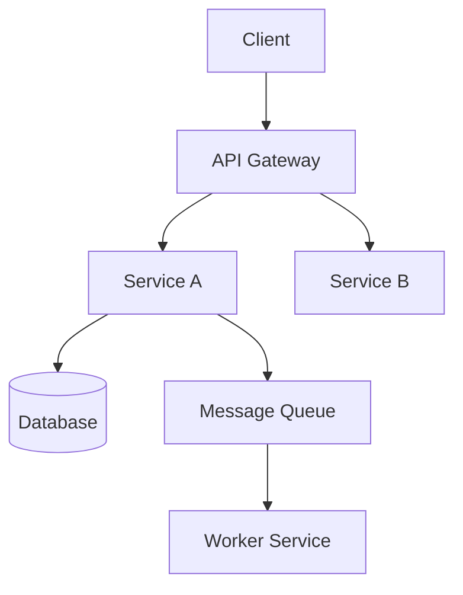
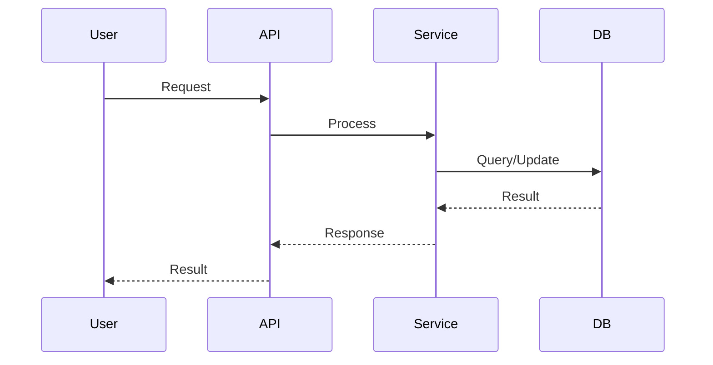

# Software Design Document (SDD/TDD) Reference Template

This template follows Google-style design doc practices enhanced with SOTA elements from
AWS, Microsoft, Uber, and Spotify. Fill in project-specific content based on the codebase and
user's description — never leave placeholder brackets in the final output.

## Table of Contents

- [Template](#template)
- [Writing Guidance](#writing-guidance)
- [Reviewer Checklist](#reviewer-checklist)

---

## Template

```markdown
# [Feature/Component Name] — Design Document

**TL;DR:** [1-2 sentence summary of what this document proposes and why. A reviewer should
understand the core idea in 30 seconds. Example: "We propose adding a Redis-backed rate limiter
to the API Gateway to prevent abuse. This replaces the current in-memory approach that doesn't
work across multiple instances."]

---

**Project:** [Project Name]
**Author(s):** [Names]
**Reviewers:** [Names — include domain experts for security, data, infrastructure as needed]
**Date:** YYYY-MM-DD
**Status:** DRAFT | IN REVIEW | APPROVED | IMPLEMENTED | MAINTENANCE
**Related ADRs:** [ADR-NNN, ADR-NNN — link to relevant architecture decisions]
**Target Start:** YYYY-MM-DD
**Target Completion:** YYYY-MM-DD

---

## 1. Problem Statement and Motivation

### What problem are we solving? Why now?

**Current situation:**
- [What exists today and what's broken or missing]
- [Quantified impact: users affected, error rates, cost, developer pain]

**Opportunity:**
- [Why fixing this matters now — business driver, customer pain, technical risk]
- [What happens if we don't act — cost of inaction]

### Goals

What are we trying to achieve? Each goal should be measurable.

- [ ] [Goal 1 — quantified: "Reduce p99 latency from 800ms to 200ms"]
- [ ] [Goal 2 — quantified: "Support 50K concurrent users"]
- [ ] [Goal 3 — quantified: "Reduce deployment time from 30min to 5min"]

### Non-Goals

Explicitly what we are NOT doing. This prevents scope creep and sets clear boundaries for reviewers.

- [Non-goal 1 — "We are NOT redesigning the database schema"]
- [Non-goal 2 — "We are NOT supporting offline mode in this phase"]
- [Non-goal 3 — "We are NOT migrating existing users — only new signups"]

### Success Metrics

| Metric | Current | Target | Timeline | How to Measure |
|---|---|---|---|---|
| [Metric 1] | [Current value] | [Target value] | [When] | [Measurement tool/method] |
| [Metric 2] | ... | ... | ... | ... |

---

## 2. Requirements

### Functional Requirements

**[Requirement Area 1]**
- [Specific, testable requirement]
- [Specific, testable requirement]

**[Requirement Area 2]**
- [Specific, testable requirement]

### Non-Functional Requirements

| Category | Requirement | Target | Rationale |
|---|---|---|---|
| Performance | [e.g., API response time] | [e.g., p99 < 200ms] | [Why this target] |
| Availability | [e.g., Uptime SLA] | [e.g., 99.95%] | [Contractual or business need] |
| Scalability | [e.g., Concurrent users] | [e.g., 50K] | [12-month projection] |
| Security | [e.g., Authentication] | [e.g., OAuth2 + MFA] | [Compliance requirement] |
| Data Consistency | [e.g., Transaction guarantees] | [e.g., ACID for payments] | [Correctness critical] |

### API Contracts (if applicable)

Define the key API interfaces this feature will expose or modify:

```
[METHOD] /api/v1/[resource]
Request:  { field1, field2 }
Response: { field1, field2, field3 }
Errors:   [status codes and meanings]
```

---

## 3. Proposed Design

### Architecture Overview

[1-2 paragraphs describing the high-level approach. What components are involved? How do they
interact? What's the core insight of this design?]



### Component Design

For each major component, describe its purpose, technology, interfaces, and dependencies.

#### Component: [Name]

**Purpose:** [What it does — single responsibility]
**Technology:** [Stack choices]
**Interfaces:**
- [API/event exposed]

**Dependencies:**
- [What it needs]

**Constraints and Trade-offs:**
- [Key design choice and why]

### Data Model

[Entity descriptions, schema changes, or data flow. Use SQL, JSON, or diagrams as appropriate.]

```sql
-- New or modified tables
CREATE TABLE [table_name] (
    id UUID PRIMARY KEY,
    -- columns with types and constraints
    created_at TIMESTAMP DEFAULT NOW()
);
```

### Key Data Flows

Describe the critical workflows step by step:



### Technology Justification

| Technology | Alternative(s) | Why Chosen |
|---|---|---|
| [Choice 1] | [Alternative] | [Reasoning tied to requirements] |
| [Choice 2] | [Alternative] | [Reasoning] |

---

## 4. Alternatives Considered

For each alternative, explain what it is, its pros/cons, and why it was rejected. The reasoning
behind rejections is often more valuable than the chosen approach.

### Alternative 1: [Name]

**What:** [1-2 sentence description]
**Pros:** [Benefits]
**Cons:** [Drawbacks]
**Trade-off decision:** REJECTED — [Why, tied to specific requirements or drivers]

### Alternative 2: [Name]

**What:** [1-2 sentence description]
**Pros:** [Benefits]
**Cons:** [Drawbacks]
**Trade-off decision:** REJECTED — [Why]

---

## 5. Cross-Cutting Concerns

### Security and Privacy

**Authentication/Authorization:**
- [How users/services are authenticated]
- [Authorization model (RBAC, ABAC, etc.)]

**Data Protection:**
- [Encryption in transit and at rest]
- [PII handling and masking]
- [Compliance requirements (GDPR, PCI-DSS, etc.)]

**Threat Mitigations:**
| Threat | Mitigation |
|---|---|
| [Threat 1] | [How it's addressed] |
| [Threat 2] | [How it's addressed] |

### Reliability and Fault Tolerance

| Failure Scenario | Handling | Recovery |
|---|---|---|
| [Component X fails] | [Degradation strategy] | [Recovery approach] |
| [External API timeout] | [Retry/circuit breaker] | [Fallback behavior] |

### Observability

- **Logging:** [Structured logging approach, correlation IDs]
- **Metrics:** [Key metrics to track, alerting thresholds]
- **Tracing:** [Distributed tracing approach]

### Performance

| Metric | Target | Optimization Strategy |
|---|---|---|
| [Metric 1] | [Target] | [How to achieve it] |
| [Metric 2] | [Target] | [How to achieve it] |

### Cost Analysis (if applicable)

| Resource | Monthly Cost | Notes |
|---|---|---|
| [Infrastructure 1] | [$X] | [Scaling assumptions] |
| [Infrastructure 2] | [$X] | [Scaling assumptions] |
| **Total** | **[$X]** | |

---

## 6. Implementation Plan

### Phased Rollout

**Phase 1: [Name] (Weeks N-N)**
- [ ] [Task 1]
- [ ] [Task 2]
- [ ] [Milestone / gate: what must be true before next phase]

**Phase 2: [Name] (Weeks N-N)**
- [ ] [Task 1]
- [ ] [Task 2]

**Phase 3: Canary and GA (Week N)**
- [ ] [Canary deploy percentage]
- [ ] [Monitoring period]
- [ ] [Full rollout criteria]

### Rollback Plan

If the deployment causes issues, here is how we revert:

- **Rollback trigger:** [What conditions trigger a rollback — e.g., error rate > 5%]
- **Rollback steps:** [Concrete steps to revert]
- **Data rollback:** [How to handle data written during the failed deploy, if applicable]
- **Communication:** [Who to notify]

### Migration Strategy (if applicable)

- **Backward compatibility:** [How existing clients continue to work]
- **Data migration:** [Steps, downtime expectations, validation]
- **Deprecation timeline:** [When old system/API is removed]

### Risk Assessment

| Risk | Probability | Impact | Mitigation |
|---|---|---|---|
| [Risk 1] | Low / Medium / High | Low / Medium / High | [How to mitigate] |
| [Risk 2] | ... | ... | ... |

---

## 7. Testing Strategy

**Unit Tests:**
- [What logic is tested at unit level]

**Integration Tests:**
- [What integrations are tested — DB, APIs, message queues]

**Load Testing:**
- [Tool, target load, acceptance criteria]

**E2E Tests:**
- [Critical user flows tested end-to-end]

---

## 8. Acceptance Criteria

Testable, specific criteria that determine when this feature is complete:

- [ ] [Criterion 1 — measurable and verifiable]
- [ ] [Criterion 2]
- [ ] [Criterion 3]
- [ ] Security review passed
- [ ] Load test meets performance targets
- [ ] Documentation updated

---

## 9. Open Questions

| Question | Owner | Deadline | Resolution |
|---|---|---|---|
| [Question 1] | [Name] | [Date] | [Pending / Resolved: answer] |
| [Question 2] | [Name] | [Date] | [Pending / Resolved: answer] |

---

## Appendices

### A. Sequence Diagrams

[Additional Mermaid diagrams for complex flows]

### B. API Documentation

[Link to OpenAPI/Swagger spec or detailed endpoint documentation]

### C. References

- [Link 1 — relevant documentation or prior art]
- [Link 2]
```

---

## Writing Guidance

### What Makes a Good Design Doc

The purpose of a design doc is to **reach consensus before writing code** (Google's phrase). A
good design doc helps reviewers quickly understand the problem, evaluate the proposed solution,
and challenge trade-offs.

**Structure your thinking, not your prose.** The sections above are a guide, not a straitjacket.
Skip sections that don't apply. Expand sections that need more detail. A design doc for a small
feature might be 3-5 pages. A major system change might be 15-20 pages.

**Lead with the TL;DR.** A reviewer should understand the core proposal in 30 seconds. If they
need to read the entire document to know what you're proposing, restructure.

**Goals and Non-Goals are critical.** These set the boundary of the design review. Without
explicit non-goals, every reviewer will suggest expanding scope.

**Alternatives are mandatory.** If there's only one possible approach, you probably haven't
thought hard enough. Show at least 2 alternatives and explain why they were rejected.

**Be specific about trade-offs.** "We chose X over Y" is incomplete. "We chose X over Y,
accepting slower writes in exchange for strong consistency" tells the reader what to watch out for.

### Status Lifecycle

```
DRAFT → IN REVIEW → APPROVED → IMPLEMENTED → MAINTENANCE
```

- **DRAFT**: Author is still writing; not ready for formal review
- **IN REVIEW**: Open for comments and feedback (set a deadline — typically 3-5 business days)
- **APPROVED**: Reviewers have signed off; implementation can begin
- **IMPLEMENTED**: Feature is deployed and operational
- **MAINTENANCE**: Document is kept current as the feature evolves

---

## Reviewer Checklist

Use this checklist when reviewing a design document:

- [ ] **TL;DR is clear** — Core proposal understandable in 30 seconds
- [ ] **Problem is well-defined** — Current state, impact, and urgency are clear
- [ ] **Goals are measurable** — Each goal has a quantified target
- [ ] **Non-goals are explicit** — Scope is bounded
- [ ] **Design addresses requirements** — All functional and non-functional requirements covered
- [ ] **Alternatives considered** — At least 2 alternatives with trade-off analysis
- [ ] **Trade-offs are explicit** — What we gain and what we sacrifice
- [ ] **Security reviewed** — Threat model, data protection, auth/authz
- [ ] **Failure modes covered** — What happens when things go wrong
- [ ] **Rollback plan exists** — How to undo the deployment
- [ ] **Testing strategy defined** — Unit, integration, load, E2E coverage
- [ ] **Acceptance criteria are testable** — Clear definition of "done"
- [ ] **Cost implications noted** — Infrastructure and operational costs
- [ ] **Related ADRs linked** — Key decisions cross-referenced
